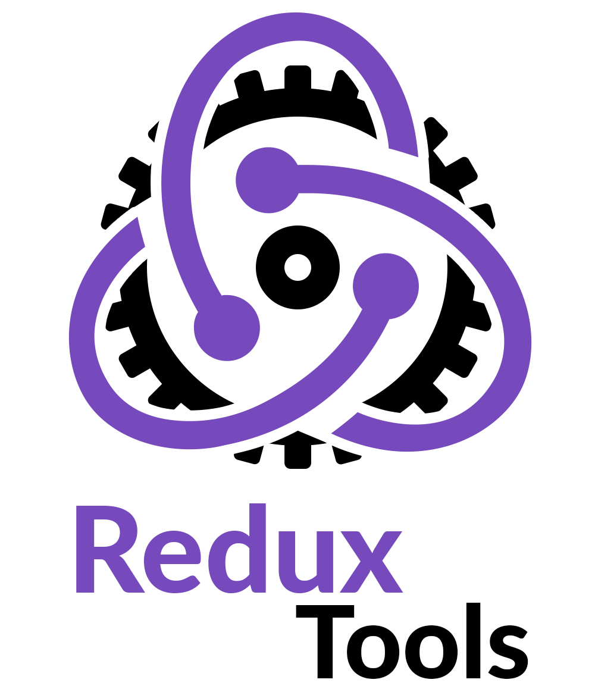

# Redux Tools

> Usage of Redux Tools assumes basic knowledge of the [Redux](https://redux.js.org/) library.

A collection of [store enhancers](https://github.com/reduxjs/redux/blob/master/docs/Glossary.md#store-enhancer) and utility functions for injecting reducers, middleware, and epics into a store after the store is created.

## Documentation & API Reference

See [https://lundegaard.github.io/redux-tools/](https://lundegaard.github.io/redux-tools/)

## Resources

- [Beyond Simplicity: Using Redux in Dynamic Applications](https://medium.com/@wafflepie/beyond-simplicity-using-redux-in-dynamic-applications-ae9e0aea928c) (published 21 Jan 2019)
- [React Union repository](https://github.com/lundegaard/react-union) (embedding React applications into CMSs)

## License

All packages are distributed under the MIT license. See the license [here](https://github.com/lundegaard/redux-tools/blob/master/LICENSE).
