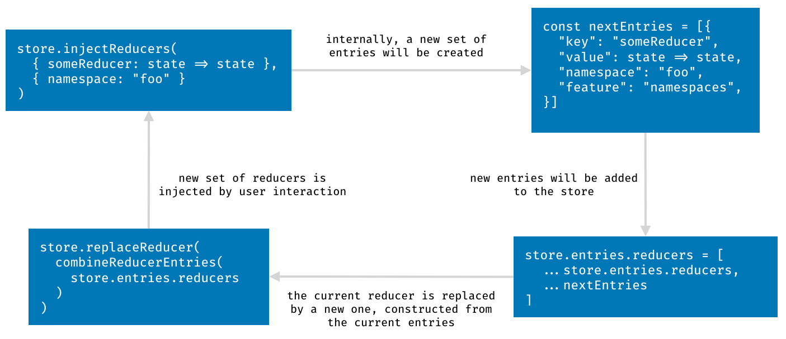

# FAQ: Internals {docsify-ignore-all}

## What happens under the hood when we inject something?

The lifecycle of all injectables (i.e. reducers, middleware, and epics) is
always the same. Let's assume that we've got a new store with an epics enhancer (always exported as
`makeEnhancer` from the appropriate package). It adds two methods to our `store`:

- `injectEpics()`
- `ejectEpics()`

This enhancer also defines a `store.entries.epics` array, storing all the injected epics.

```json
{
	"entries": {
		"epics": []
	}
	// This is where the functions `dispatch`, `getState`, `replaceReducer` are as well.
	// Remember that the Redux store is just an object – a collection of functions.
}
```

If we inject a bunch of epics, they will get converted into entries first.

```js
store.injectEpics({ someEpic, anotherEpic }, { namespace: 'foo', feature: 'bar' });
```

Turns into:

```js
const entries = [
	{
		feature: 'bar',
		namespace: 'foo',
		key: 'someEpic',
		value: someEpic, // The epic itself.
	},
	{
		feature: 'bar',
		namespace: 'foo',
		key: 'anotherEpic',
		value: anotherEpic, // The epic itself.
	},
];
```

These entries are added to the `store.entries.epics` array (this array is essentially a set, it allows no duplicates). New entries are processed differently based on the type of the injectable.

- Epics: the root epic consumes a stream of entries.
- Reducers: the root reducer is assembled form `store.entries.reducers` directly.
- Middleware: the root middleware iterates over the current `store.entries.middleware` per each action.

Here is a visual representation as well.


