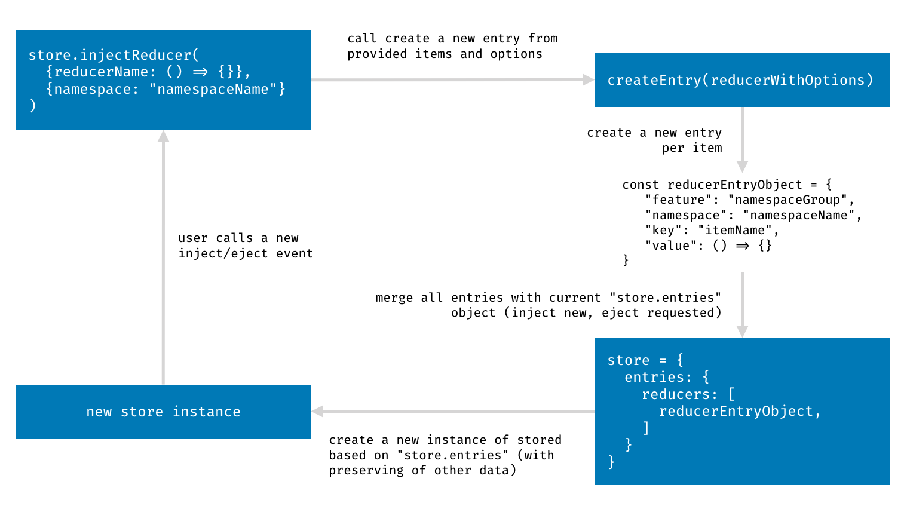

# Injectors

> yarn add @redux-tools/injectors

Internal reusable logic for the injection mechanism itself. We store all reducers and epics as an 
array of entries. An entry is an object with the key, value, namespace and feature properties.

## Lifecycle

A lifecycle of all injectable parts (i.e. reducers, middleware, epics, let's call them _items_) is 
always the same. Let's assume that we've got a new store with an _item_ enhancer (always exported as
`makeEnhancer` from the appropriate _item_ package). It adds two methods to our `store`:

- `injectItem()`
- `ejectItem()`

And an object `entries` (again into `store`), so `store.entries` could look like:

```json
{
   "entries": {
      "item": [],

      "reducers": [],
      "middleware": [],
      "epics": []
   }
}
```

Now you are allowed to inject new or eject existing _items_ into/from their arrays. Calling 
of `store.injectItem(itemInstance)` converts `itemInstance` into common "entry" object, e.g.

```javascript
const entry = {
   "feature": "namespaceGroup",
   "namespace": "namespaceName",
   "key": "itemName",
   "value": () => {}
}
```

And adds it into appropriate `store.entries` array (`store.entries.item`). Then a new version of 
store (`createStore` function) based on `store.entries` is created and replaced with current store.
   


## API Reference

### createEntries()

Converts the input of `store.injectSomething()` or `store.ejectSomething()` to an array of standalone entries.

**Arguments**
1. ( _Object | Function_ ) injectables an object or function with injectables as values
2. ( _Object_ ) props to store in the entry, e.g. `namespace` or `feature`

**Return**
( _Array_ ): An array of entries

**Example**

```javascript
import { createEntries } from '@redux-tools/injectors';
 
createEntries({
  foo: 'bar',
  bar: 'baz',
}, {
  namespace: 'ns',
  feature: 'grid',
});
/*
[
   { key: 'foo', value: 'bar', namespace: 'ns', feature: 'grid' },
   { key: 'bar', value: 'baz', namespace: 'ns', feature: 'grid' },
]
*/
```


### enhanceStore()

!> TODO: enhanceStore

**Arguments**

**Example**


### makeStoreInterface()

Creates an object of variables and methods for interacting with appropriate part of the store. 

**Arguments**

1. `type` ( _string_ ): Type of injectables

**Example**

```javascript
import { makeStoreInterface } from '@redux-tools/injectors';

const interface = makeStoreInterface('reducers');
// interface.type === 'reducers'
// interface.injectionKey === 'injectReducers'
// interface.ejectionKey === 'ejectReducers'
// interface.getEntries === (...) => {...}
// interface.setEntries === (...) => {...}
```

### FUNCTION_KEY

!> TODO: FUNCTION_KEY
